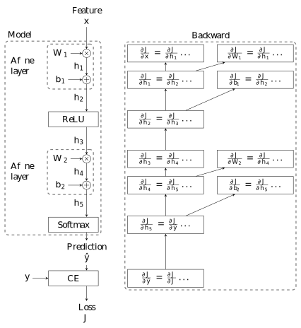

# Algorithmic differentiation for machine learning
or one of the reasons, why neuronal networks got so popular.

Training neuronal networks (NN) is usually done with stochastic gradient decent (SGD) or an advanced version of SGD with momentum etc. (e.g. Adam).
In frameworks there is an abstraction for the gradient calculation.
It is sufficient, when the user defines how the loss is calculated
and the framework does the calculation of the gradients.

In this project we want to take a closer look how these gradients are obtained.
To follow the project it is not nessesary to know neuronal networks (NN), 
but the motivation will be most of the time come from NN.

Prerequisites: Solid Python knowledge including NumPy
Knowledge about neuronal networks is not a requirement.

## (Stochastic) gradient decent

Gradient decent is an algorithm that minimizes a cost function given some parameters.
For example the cost function of linear least squares:
$$
    J^{\mathrm{Linear Least Squares}} = \sum_n (y_n - \hat y_n)^2 = \sum_n (y_n - {\mathbf{x}}^T\boldsymbol{\theta})^2
$$
where $y_n$ is the True values, $\hat y_n$ the estimate, ${\mathbf{x}}$ the observation and $\boldsymbol{\theta}$ are the learnable parameters. Node bold symbols (e.g. $\mathbf{x}$) indicate vectors and non bold symbold scalars (e.g. $x$).

Also this function has a closed form solution, we can apply the gradient decent algorithm
$$
    \boldsymbol{\theta}^{\mathrm{new}}
    = \boldsymbol{\theta}^{\mathrm{old}} - \mu \frac{\partial J}{\partial \boldsymbol{\theta}}\bigg|_{\boldsymbol{\theta}=\boldsymbol{\theta}^{\mathrm{old}}} 
    = \boldsymbol{\theta}^{\mathrm{old}} - \mu
    \begin{bmatrix} 
        \frac{\partial J}{\partial \theta_0} \\
        \frac{\partial J}{\partial \theta_1}
    \end{bmatrix}
    \bigg|_{\boldsymbol{\theta}=\boldsymbol{\theta}^{\mathrm{old}}}
$$
So we start with an value for $\boldsymbol{\theta}^{\mathrm{old}}$, calculate the gradient of the cost function w.r.t. each parameter and substract the the gradient from the old value with a learnung rate $\mu$.
With a sufficient small learning rate and enough iterations the parameters will converge to the optimal parameters.

For the linear least squares problem is the gradient decent algorithm not recommented, because there exists a closed form solution.
The advantage of gradiend decent is, that you can calculate the gradient also for cost functions, where no closed form solution is known.
So gradient decent works for much more cost functions.

## Chain rule

The most important derivative rule in the project is the chain rule:

$$
   J = f(\hat y),\quad \hat y = g(\theta)
$$
$$
   \frac{\partial J}{\partial \theta} = \frac{\partial J}{\partial \hat y}\frac{\partial \hat y}{\partial \boldsymbol{\theta}}
$$

## Algorithmic differentation

> In mathematics and computer algebra, automatic differentiation (AD), 
> also called algorithmic differentiation or computational differentiation,[1][2] 
> is a set of techniques to numerically evaluate the derivative of a function specified 
> by a computer program. 
> AD exploits the fact that every computer program, no matter how complicated, 
> executes a sequence of elementary arithmetic operations (addition, subtraction, multiplication, 
> division, etc.) and elementary functions (exp, log, sin, cos, etc.). 
> By applying the chain rule repeatedly to these operations, 
> derivatives of arbitrary order can be computed automatically, 
> accurately to working precision, 
> and using at most a small constant factor more arithmetic operations than the original program.
> 
> Automatic differentiation is neither:
> - Symbolic differentiation, nor
> - Numerical differentiation (the method of finite differences).
>
> Symbolic differentiation can lead to inefficient code and faces the 
> difficulty of converting a computer program into a single expression, 
> while numerical differentiation can introduce round-off errors in the discretization process 
> and cancellation. 
> Both classical methods have problems with calculating higher derivatives, 
> where complexity and errors increase. 
> Finally, both classical methods are slow at computing partial 
> derivatives of a function with respect to many inputs, 
> as is needed for gradient-based optimization algorithms. 
> Automatic differentiation solves all of these problems, 
> at the expense of introducing more software dependencies.[citation needed]
 >
 > -- Wikipedia contributors, "Automatic differentiation," Wikipedia, The Free Encyclopedia, https://en.wikipedia.org/w/index.php?title=Automatic_differentiation&oldid=906103043 (accessed August 6, 2019).


## Forward mode

$$
   J = f(\hat y),\quad \hat y = g(h),\quad h = e(\theta)
$$
$$
   \frac{\partial J}{\partial \theta} = 
        \frac{\partial J}{\partial \hat y}
        \left(
            \frac{\partial \hat y}{\partial h}
            \frac{\partial h}{\partial \boldsymbol{\theta}}
        \right)
$$

## Reverse mode

$$
   J = f(\hat y),\quad \hat y = g(h),\quad h = e(\theta)
$$
$$
   \frac{\partial J}{\partial \theta} = 
        \left(
            \frac{\partial J}{\partial \hat y}
            \frac{\partial \hat y}{\partial h}
        \right)
        \frac{\partial h}{\partial \boldsymbol{\theta}}
$$

## NN example

```python
model = Sequential([
    LinearLayer(in_size, hidden_size),
    relu,
    LinearLayer(hidden_size, out_size),
])

feature = ...
log_posterior = model(feature)
posterior = softmax(log_posterior)
loss = binary_cross_entropy(posterior, label)

gradients = loss.backward()
optimizer(model.variables, gradients)
```




